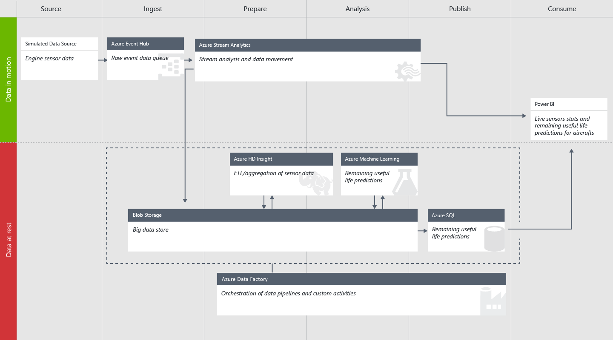
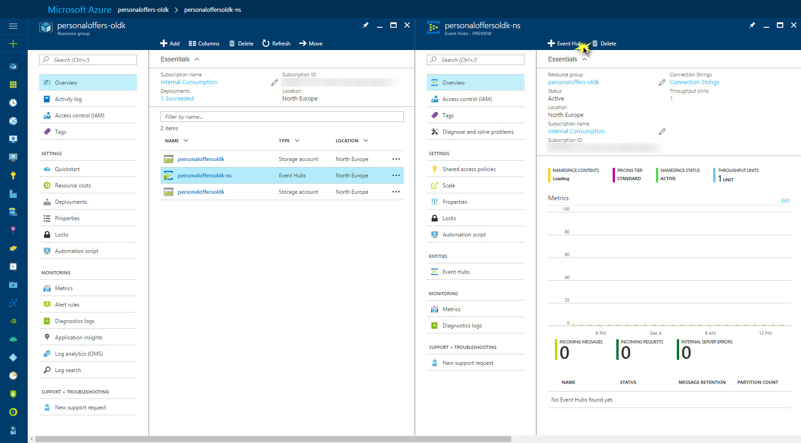
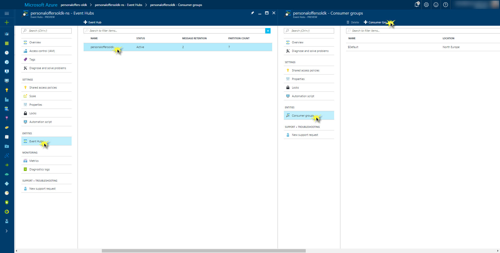
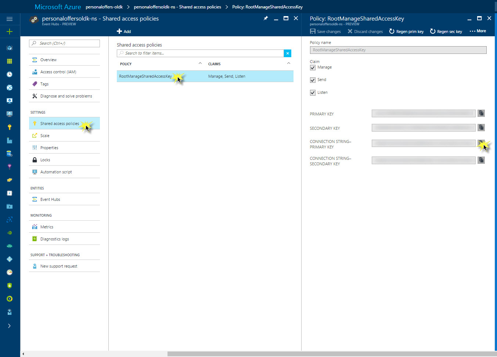

The guide below provides a full set of instructions on how to put together and deploy a predictive maintenance solution using the [Cortana Intelligence Suite](https://www.microsoft.com/en-us/cloud-platform/cortana-intelligence-suite). The **[Developer Journey Map](./DeveloperJourneyMap.pdf)** walks through the different components created as part of the end-to-end solution. 

# Hands On Lab: Predictive Maintenance 

There is a lot of documentation around the Cortana Intelligence Suite Solution Template for predictive maintenance for aerospace that predicts the remaining useful life of an aircraft engine.
     
There is an overview [blog post](https://blogs.technet.microsoft.com/machinelearning/2016/02/23/predictive-maintenance-for-aerospace-a-cortana-analytics-solution-template/) and a [technical guide](https://azure.microsoft.com/en-us/documentation/articles/cortana-analytics-technical-guide-predictive-maintenance) that provide a higher level overview of the [solution template](https://gallery.cortanaintelligence.com/SolutionTemplate/Predictive-Maintenance-for-Aerospace-1) . 

This information is incredibly useful to understand the concepts behind and technology that went into creating it but does not provide the deep systems understanding that implementers need to understand the design in total. 

This lab explains how to build the solution piece by piece and in many cases explains why certain decisions were made. The manual process gives an implementer an inside view on how the solution is built and an understanding of each of the components.

# Requirements
This section contains required accounts and software you will need to create this solution.

1.	The full contents of this GitHub repo (either cloned or downloaded as a zip file).
2.	A Microsoft Azure subscription. 
3.	A Microsoft Office 365 subscription for Power BI access.
4.	A network connection
5.	[SQL Server Management Studio](https://msdn.microsoft.com/en-us/library/mt238290.aspx ) OR another similar tool to access a SQL server database, e.g. [Visual Studio Community](https://www.visualstudio.com/de/vs/community/) or [Visual Studio Code](https://code.visualstudio.com) with the [MSSQL extension](https://marketplace.visualstudio.com/items?itemName=ms-mssql.mssql)
6.	[Microsoft Azure Storage Explorer](http://storageexplorer.com/)
7.	[Power BI Desktop](https://powerbi.microsoft.com/en-us/desktop)

# Architecture

The image shows the overall architecture of the Cortana Intelligence Suite Solution Template for predictive maintenance for aerospace that the remainder of this guide describes in detail. 
 
For more information on the architecture, have a look at the corresponding [blog post](https://blogs.technet.microsoft.com/machinelearning/2016/02/23/predictive-maintenance-for-aerospace-a-cortana-analytics-solution-template/).

# Setup Steps

The document walks the reader through the creation of many different Cortana Intelligence Suite services with the end result of replicating the architecture defined previously. As there are several services, it is suggested to group these services under a single [Azure Resource Group](https://azure.microsoft.com/en-us/documentation/articles/resource-group-overview/)

Similarly, we want to use a common name for the different services we are creating. The remainder of this document will use the assumption that the base service name is:

aerospacetemplate[UI][N]

Where ***[UI]*** is the user's initials and ***N*** is a random integer that you choose. Characters must be entered in in lowercase. Several services, such as Azure Storage, require a unique name for the storage account across a region and hence this format should provide the user with a unique identifier.

So for example, Steven X. Smith might use a base service name of *aerospacetemplatesxs01*. 

## 1.	Create a new Azure Resource Group
-	Navigate to ***portal.azure.com*** and log in to your account.
-	On the left tab click ***Resource Groups***
-	In the resource groups page that appears, click ***Add***
-	Provide a name ***aerospacetemplate_resourcegroup***
-	Set the location to North Europe
-	Click ***Create***

## 2.	Azure Storage Account
An ***Azure Storage*** account is used for storage of incoming aircraft sensor readings through 
***Azure Event Hub*** and ***Azure Stream Analytics***. The storage account is also used to hold HIVE 
scripts that will be executed from ***Azure Data Factory*** when processing the sensor data to pass 
into the ***Azure Machine Learning*** experiment. 

-	Navigate to ***portal.azure.com*** and login in to your account.
-	On the left tab click **New>Data and Storage>Storage Account**
-	Leave the deployment model to *Resource manager* and click create.
-	Set the name to aerospacetemplate[UI][N]
-	Set the resource group to the resource group we created by selecting the link Choose Existing
-	Location set to North Europe
-	Click ***Create***
-	Wait for the storage account to be created.

Now that the storage account has been created we need to collect some information about it 
for other services like ***Azure Data Factory***. 

-	Navigate to ***portal.azure.com*** and login in to your account.
-	On the left tab click ***Resource Groups***
-	Click on the resource group we created earlier ***aerospacetemplate_resourcegroup*** 
-	Click on the storage account in Resources
-	In the *Settings* tab on the right click *Keys*
-	Copy the *PRIMARY KEY* and add it to text file [connectioninformation.txt](./connectioninformation.txt).

| Azure Storage Account Information     |  |
|-------------------|----------|
|  Storage Account Name  |  aerospacetemplate[UI][N]  |
|  Storage Account Key |    |

 
### Prepare the storage account
-	Download and install the [Microsoft Azure Storage Explorer](http://storageexplorer.com/)
-	Log in to your Microsoft account associated with your Azure Subscription
-	Locate the storage account created in step 2 above and expand the nodes to see *Blob Containers*, etc.
-	Create the two containers, *maintenancesadata* and *maintenancesascript*

      1.	Right click on ***Blob Containers*** and choose ***Create Blob Container***
      1.	Enter one of the container names.
      1.	Repeat steps 1 and 2 until both containers are created.

-	Right click the *maintenancesascript* container and choose ***Open Blob Container Editor***
-	In the right panel, above the container listing, click the arrow on the ***Upload*** button and choose ***Upload Folder***
-	Browse to the ***Storage Files\script\hive*** folder in the ZIP content. This will upload the required HIVE queries that will be used in data processing.

## 3.	Azure Event Hub
Azure Event Hubs is a highly scalable service that can ingest millions of records a second. This will be the ingestion point for the aircraft sensor data.
-	Navigate to ***portal.azure.com*** and login in to your account.
-	On the left tab click ***Resource Groups***
-	Click on the resource group we created earlier ***aerospacetemplate_resourcegroup*** 
-	On the resource page click ***Add***
-	On the page that appears on the right, type Event Hub in the search box. 
-	Choose ***Event Hub***
-	Click ***Create*** on the page that comes up.
- 	Fill out the following configurations:
	-   ***Name***: aerospacetemplate[UI][N]-ns
	-	***Pricing Tier***: *Standard*
	-	***Resource Group***: Choose the resource group we created earlier, ***aerospacetemplate_resourcegroup***
	-	***Location***: North Europe
-	Click ***Create***

We have now created the Service Bus namespace. Click on the newly created "Event Hubs" and add an event hub:
-   ***Name***: aerospacetemplate[UI][N]
-	***Partition Count***: 4
-	***Message Retetion***: 7
-	***Archive***: off

This creates the Azure Event Hub we need to receive aircraft sensor readings. The Event Hub will be consumed by two Azure Stream Analytics jobs. To ensure processing of the hub is successful we need to create [consumer groups](https://azure.microsoft.com/en-us/documentation/articles/event-hubs-programming-guide/#event-consumers) on the hub.

-	Click on the tab ***Event Hubs***
-	In the new blade under ***Entities***, click on ***Consumer Groups***.
-   In the top bar, click to add a consumer group
-   Type in *blobcg* in the Name field. 
Repeat this step to create the *pbicg* consumer group

Finally, we need to record the connection information for this event hub so that we can feed in event data from our data generator. While on the page for your service bus do the following: 

- 	Navigate back to the blade of the service bus namespace
-	Click on the ***Shared access policies*** tab and open the current policy ***RootManageSharedAccessKey***
-	In the newly opened blade on the already created policy, copy the ***CONNECTION STRING - PRIMARY KEY***

The connection string and event hub name information will be needed to configure the desktop data generation tool that simulates aircraft sensor readings being sent to the event hub. Add the following information into [connectioninformation.txt](./connectioninformation.txt).

| Azure Event Hub     |  |
|-------------------|----------|
|  Event Hub  |  aerospacetemplate[UI][N]  |
|  Namespace |  aerospacetemplate[UI][N]-ns  |
|  Connection String |    |

## 4.	Azure Stream Analytics Jobs
[Azure Stream Analytics](https://azure.microsoft.com/en-us/services/stream-analytics/) allows you to create near real-time insights from devices, sensors, infrastructure and applications. For this demo Azure Stream Analytics is used to create two jobs that read sensor data from the *Azure Event Hub*.
 
The first job simply pipes all of the sensor readings into our *Azure Storage* for later processing. The second job is used to populate Power BI datasets that will be used on the dashboard. Although we have not set up *Power BI* yet, we will create both stream jobs now.

The names of the two jobs are ***maintenancesa02asablob*** and ***maintenancesa02asapbi***. For each of these two job names follow the next steps.

-	Navigate to ***portal.azure.com and login*** in to your account.
-	On the left tab click ***Resource Groups***
-	Click on the resource group we created earlier ***aerospacetemplate_resourcegroup*** 
-	On the resource page click ***Add***
-	On the page that appears on the right, type *Stream Analytics Job* in the search box. 
-	From the search results choose *Stream Analytics Job*
-	On the page that appears on the right click ***Create***
-	Enter a job name 
-	Choose the resource group created earlier ***aerospacetemplate_resourcegroup***
-	Choose the location as North Europe
-	Click ***Create***

Once both jobs have been created, they can be configured. Both jobs will have the same input Event Hub, but will have different [stream queries](https://msdn.microsoft.com/en-us/library/azure/dn834998.aspx) and different outputs. 

### 4.a. maintenancesa02asablob

First we will configure the input, query and output of the Azure Stream Analytics job ***maintenancesa02asablob***.

#### 4.a.1. Input
-	Navigate to ***portal.azure.com*** and login in to your account.
-	On the left tab click ***Resource Groups***
-	Click on the resource group we created earlier ***aerospacetemplate_resourcegroup*** 
-	Click on the one of the Stream Analytics jobs that was created in the earlier steps.
-	Under ***Job Topology*** click ***INPUTS***
-	In the ***Inputs*** frame, Click ***ADD*** at the top
-	Enter the following inputs:
	- ***Input Alias***: EventHubSource
	- ***Source Type***: Data Stream
	- ***Source***: Event Hub
	- ***Service bus namespace***: Select the namespace you created above, aerospacetemplate[UI][N]-ns
	- ***Event Hub Name***: Select the event hub you created above, aerospacetemplate[UI][N]
	- ***Event hub consumer group***: *blobcg*
	- ***Event Serialization Format***: CSV
- Click ***Create***	

#### 4.a.2. Query
- 	Return to the main frame for the maintenancesa02asablob job
- 	Under ***Job Topology*** click ***Query*** 
- 	In the query box, copy the contents of the ***maintenancesa02asablob.txt*** located in under the *./Stream Analytics Queries/* file path in the package.
- 	Click ***Save***

#### 4.a.3. Output
- 	Return to the main frame for the maintenancesa02asablob job
-	Under ***Job Topology*** click ***Outputs***
- 	In the ***Outputs*** frame, Click ***ADD*** at the top
-	Enter the following settings:
	- ***Output Alias***: RawDataBlobSink
	- ***Sink***: Blob storage
	- ***Storage Account***: Select the storage account you created above, ***aerospacetemplate[UI][N]***
	- ***Container***: maintenancesadata
	- ***path pattern***: rawdata/date={date}/hour={time}
	- ***Date format***: Change the format from YYYY/MM/DD to YYYY-MM-DD.
	- ***Time format***: HH
	- ***Event serialization format***: CSV
	- ***Delimiter***: comma (,)
-   Click ***Create***. 
-	Click ***START*** to get the stream job started.

### 4.b. maintenancesa02asapbi

Now we will configure the input, query and output of the other Azure Stream Analytics job ***maintenancesa02asapbi***.

#### 4.b.1. Input
-	Navigate to ***portal.azure.com*** and login in to your account.
-	On the left tab click ***Resource Groups***
-	Click on the resource group we created earlier ***aerospacetemplate_resourcegroup*** 
-	Click on the one of the Stream Analytics jobs that was created in the earlier steps.
-	Under ***Job Topology*** click ***INPUTS***
-	In the ***Inputs*** frame, Click ***ADD*** at the top
-	Enter the following inputs:
	- ***Input Alias***: EventHubSource
	- ***Source Type***: Data Stream
	- ***Source***: Event Hub
	- ***Service bus namespace***: Select the namespace you created above, aerospacetemplate[UI][N]-ns
	- ***Event Hub Name***: Select the event hub you created above, aerospacetemplate[UI][N]
	- ***Event hub consumer group***: *pbicg*
	- ***Event Serialization Format***: CSV
- Click ***Create***	

#### 4.b.2. Query
- 	Return to the main frame for the maintenancesa02asapbi job
- 	Under ***Job Topology*** click ***Query*** 
- 	In the query box, copy the contents of the ***maintenancesa02asapbi.txt*** located in under the *./Stream Analytics Queries/* file path in the package.
- 	Click ***Save***

#### 4.b.3. Output

There are 3 Power BI outputs that need to be created. Each are identified in the query and they are ***Aircraftmonitor***, ***Aircraftalert***, and ***Flightsbyhour***. For each of these data sets you will add an output:

- 	Return to the main frame for the maintenancesa02asapbi job
-	Under ***Job Topology*** click ***Outputs***
- 	In the ***Outputs*** frame, Click ***ADD*** at the top
-	Enter the following settings:
	- ***Output Alias***: Aircraftmonitor
	- ***Sink***: Power BI
-   Click the *Authorize Now* button to link to your Office 365 subscription.
-   After authorizing, enter the following information:
	- ***DATASET NAME***: Aircraftmonitor
	- ***TABLE NAME***: Aircraftmonitor
	- ***WORKSPACE***: My Workspace
-   Click ***Create***. 

Repeat the same steps for outputs ***Aircraftalert*** and ***Flightsbyhour***. Click ***START*** to get the stream job started.

## 5.	Configure desktop application and test Event Hub / Stream Analytics
Now that we have the event hub and stream analytics configured we can configure the event generator and test that the flow to this point is working. 

-	Navigate to the hard disk location where the project was unzipped.
-	Go into the ***Predictive Maintenance Data Generator*** directory and start the *Generator.exe* application.
-	In the left side of the application enter the event hub name and the event hub connection string that was collected earlier.
-	Click the ***Save Configuration Changes*** button.
-	Click the green ***Start*** button.
-	The status area will change to green with the text *Running*
-	In the Events section at the top of the right hand side of the application you will see the count start to increment.

### Validating initial data generation
Leaving the generator running for about 15 minutes, we can validate that the services thus far are operating as expected. 

To validate the incoming events in event hub, you can use the [Service Bus Explorer](https://github.com/paolosalvatori/ServiceBusExplorer). 

Finally, validate that the files are being created in the storage account by following these steps:

-	Open the Microsoft Azure Storage Explorer
-	Navigate to the storage account set up previously
-	Open the blob container maintenancesadata
-	Note that a sub folder *rawdata* has been created by the stream analytics job.

You may close the data generator as it is not required for the following steps. It will be needed later when the whole system is brought online after the remaining services have been configured.

## 6.	Azure SQL Server and Database
Now that we have completed the ingestion path, we can start building the data processing paths. We will use ***Azure Data Factory*** to process the data. To do so we need to set up a couple more services. First is an ***Azure SQL Database*** to hold remaining useful life predictions that are the result of running the ***Azure Machine Learning*** experiment. 

-	Navigate to ***portal.azure.com*** and login in to your account.
-	On the left tab click ***New>Data and Storage>SQL Database***
-	Enter the name ***pmaintenancedb*** for the database name
-	Under Server click the arrow and choose ***Create new server***
	-	Name : aerospacetemplate[UI][N]
	-	Enter in an administrator account name and password and save it to the table below.
	-	Under ***Create V12 server (latest update)*** choose no, then choose North Europe as the location to keep the resource in the same region as the rest of the services.
	-	Click OK
-	Once returned to the SQL Database tab, choose the resource group previously created ***aerospacetemplate_resourcegroup***
-	Click ***Create***
-	Wait for the database and server to be created.
-	From ***portal.azure.com*** click on ***Resource Groups***  then the group for this demo ***aerospacetemplate_resourcegroup***.
-	In the list of resources, click on the SQL Server that was just created.
-	Under ***Settings*** for the new database, click ***Firewall*** and create a rule called ***open*** with the IP range of 0.0.0.0 to 255.255.255.255. This will allow you to access the database from your desktop*. Click ***Save***. 
-	Launch ***SQL Server Management Studio***, or a similar tool, and connect to the database with the information you recorded in the table below.
	-	NOTE: The server name in most tools will require the full name:                             
aerospacetemplate[UI][N].database.windows.net,1433
	-	NOTE: Choose SQL Server Authentication
-	**THESE INSTRUCTIONS ARE FOR SSMS**
	-	Click on the ***pmaintenancedb*** that you created on the server.
	-	Click ***New Query*** at the tool bar.
	-	Copy and execute the SQL script located in the package directory ***Storage Files\script\SQL*** to create the necessary table for the machine learning 
-   **THESE INSTRUCTIONS ARE FOR VISUAL STUDIO CODE**
	-	Open the file ***Storage Files\script\SQL\MaintenanceSAAzureSqlDB.sql*** in Visual Studio Code
	-   Connect to ***pmaintenancedb*** by pressing F1 --> typing *sql* --> select *MS SQL: Connect*
	-   Type in the required information according to how you created your Azure SQL Database and store it as a profile, e.g. *aerospacetemplateprofile*. 
	-	Run the open SQL script by pressing F1 --> typing *sql* and selecting **MS SQL: Execute Query**. The script is to create the necessary table for the machine learning experiment and a stored procedure that will be used by ***Azure Data Factory***

**NOTE:** This firewall rule is not recommended for production level systems but for this demo is acceptable. You will want to set this rule to the IP range of your secure system.

Note the following in the connectinformation.txt:

| Azure SQL Database     |  |
|-------------------|----------|
|  Server Name  |  aerospacetemplate[UI][N]  |
|  Database|  pmaintenancedb  |
|  User Name |    |
|  Password |    |

## 7.	Create Azure Studio ML Workspace and Experiment

https://gallery.cortanaintelligence.com/Experiment/bcae226bc74a4cbbb0ff700ac97448bf 

This section assumes that you have not set up any workspaces for Studio ML but that you do have an account at ***studio.azureml.net***.

The first thing we need to do is to create the workspace. A workspace is where experiments are created. It is also tied to a storage account for intermediate results during experiment processing.

-	Navigate to ***portal.azure.com*** and login in to your account.
-	On the left tab click ***Resource Groups***
-	Click on the resource group we created earlier ***aerospacetemplate_resourcegroup*** 
-	On the resource page click ***Add***
-	On the page that appears on the right, type *Machine Learning* in the search box. 
-	From the search results choose *Machine Learning Workspace*
-	On the page that appears on the right click ***Create***
- 	Enter the following configurations:
	- ***Workspace Name***: *aerospacetemplate[UI][N]*
	- ***Resource Group***:	Choose the resource group created earlier ***aerospacetemplate_resourcegroup***
	- ***Location***: West Europe
	- ***Storage account***: Choose the storage account created earlier or create a new one (since the one before was created in North Europe)
	- ***Pricing tier***: Standard
	- ***Web Service Plan***: Create new --> ***aerospacetemplate[UI][N]Plan***
	- ***Web Service Plan Pricing Tier***: DevTest
	-	Click ***Create***

Now that we have a workspace to work within, we can copy over the required experiment from the Gallery.

-	Navigate to ***studio.azureml.net*** and log into your account
-	Navigate to the experiment [https://gallery.cortanaintelligence.com/Experiment/bcae226bc74a4cbbb0ff700ac97448bf ](https://gallery.cortanaintelligence.com/Experiment/bcae226bc74a4cbbb0ff700ac97448bf ) 
-	Click the ***Open in Studio button***. 
-	In the dialog Copy experiment from Gallery, choose appropriate West Europe and the workspace we created earlier that you would like to copy it into. Click the ***check*** button.
-	This process may take a minute, but the experiment will open in the requested workspace.
-	Click ***RUN*** at the bottom of the page. This step will take several minutes to finish and all objects in the graph will have a check box on them to indicate they have run.
-	Click ***DEPLOY WEB SERVICE [New] Preview*** at the bottom of the page to create the Azure Web Service associated with the experiment.
-	Enter *aerospacetemplate[UI][N]* as the Web Service Name.
-	Select the price plan you created in the step before (*aerospacetemplate[UI][N]Plan*) for Price Plan
-	Click the ***Deploy*** button.
-	When completed the browser will redirect to the web service home page.
	-	The web service home page can also be found by going to ***services.azureml.net*** page once logged in. 
-	Click ***Use Web Service***.
-	Copy the ***Primary key*** from the web service home page and paste it in the ***API Key*** section in the ***ConnectionInformation.txt*** file. You will need this information later. 
-	Copy the ***Batch Execution*** URI and add it to the ***ConnectionInformation.txt*** file as you will need this information later. Copy only the URI part https:.../jobs ignoring the URI parameters starting with ? .

| Web Service BES Details  |  |
|-------------------|----------|
|  API Key  |    |
|  Request URI*|  https:.../jobs  |

## 8.	Azure Data Factory
We have now created the necessary components to put the data pipeline together using ***Azure Data Factory***. Data factories are orchestration services that move and process data in a dependency flow pipeline.

The data factory we will use for this project will make use of an on demand ***HDInsight*** cluster to read from the raw data being streamed in through the event hub and stream analytics jobs. 

*HIVE* scripts are run against the raw data using the cluster to create the required aggregates and engineered features for the machine learning experiment and another *HIVE* script is executed to feed the machine learning experiments batch execution endpoint. 

The results of the experiment are put in another blob which is then copied to the ***Azure SQL Database***.
 
Based on the data, and the flow of data, this data factory will be scheduled to run every 3 hours. This means once the entire flow is configured and enabled results will not be present until approximately 3.5 hours later.

Now it is time to create the data factory:

-	Navigate to ***portal.azure.com*** and login in to your account.
-	On the left tab click ***New>Data and Analytics>Data Factory***
-	Name: *aerospacetemplate[UI][N]*
-	Resource Group: Choose the resource group created previously ***aerospacetemplate_resourcegroup***
-	Location: North Europe
-	Click ***Create***

The data factory will take some time to create. The portal page will direct you to the factory when it has been created, or you can access it through the *Resource groups* section. 

Data factories are made up of several components. Linked services define the information for the data factory to connect to other services. Datasets are named references used for input or output from an activity. Pipelines contain one or more activities to be executed. 

The next steps for the factory are to create the different parts of the factory. The following sections walk you through the steps.

### Linked Services
For this solution we are going to need 5 linked services. For these services you will need to navigate to the package location ***Data Factory\LinkedServices*** to access the scripts. 

We will create two types of linked service Store and Compute. 

-	For the two scripts *StorageLinkedService_Store.json* and *HDInsightStorageLinkedService_Store.json* copy the storage account connection string from the Azure Storage Account section and add it to the scripts.
-	On ***portal.azure.com*** navigate to your data factory, which is a resource in the created resource group, and click the ***Author and Deploy*** button.
-	For each of the two modified files:
	-	At the top of the tab, click New data store/Azure storage
	-	Overwrite the content in the editor window with the file content
	-	Click Deploy
-	Open the file *AzureSqlLinkedService_Store.json* and adjust the information in the connection string to match that of the server you created in Azure SQL Server and Database section.
-	At the top of the tab, click ***New data store/Azure SQL***
-	Overwrite the content in the editor window with the file content.
-	Click ***Deploy***

Now we have the three data store linked service created, we need to create two compute services. One for the machine learning call and one for an on demand HDInsights cluster used in the processing.

-	Open the *AzuremlBatchEndpointBatchLocation.json* and modify the mlEndponit and API key from using the information from the experiment created in Create Azure Studio ML Workspace and Experiment section.
-	On ***portal.azure.com*** navigate to your data factory and click the ***Author and Deploy*** button.
-	At the top of the tab, click ***New compute/Azure ML***
-	Copy the contents of the edited *AzuremlBatchEndpointBatchLocation.json* into the editor.
-	Click ***Deploy***
-	At the top of the tab, click ***New compute/On Demand HDInsight*** cluster
-	Copy the content of *HDInsightLinkedService_Compute.txt* into the editor window. 
-	Click ***Deploy***

The linked services are now complete, we will now move on to creating the data sets.

### Datasets
For this solution we are going to need 6 data sets that are of type Azure Storage blob and Azure SQL tables. Navigate to the package location ***Data Factory\Datasets*** to access the scripts. 

These scripts do not need to be modified in any way, simply copied in to the editor window, so for each file:

-	On ***portal.azure.com*** navigate to your data factory and click the ***Author and Deploy*** button.
-	At the top of the tab, click ***New dataset/Azure blob storage*** EXCEPT for the content of SQLScoredResultTable.txt which you will choose ***New dataset/Azure SQL***
-	Copy the contents of the file into the editor.
-	Click ***Deploy***

| NOTE|
|-------------------|
|  Datasets define the execution window of a pipeline. In the pipeline scripts under the availability section you will see that frequency is set to hour and interval is set to 3. This means these data sets are available every 3 hours in the pipeline activity period so the pipeline will run every third hour.  | 

### Pipelines

For this solution we are going to need 3 pipelines to process our raw data from stream analytics, send the aggregated values to the machine learning experiment, and then finally move those results to our SQL database. Navigate to the package location ***Data Factory\Pipelines*** to access the scripts.

There are just a few modifications that these scripts will require. 

First, in the *MLScoringPipeline* and *AggregateFlightInfoPipeline* files locate the text ***< accountname >*** near the top of the file and replace it with the name of the storage account created earlier in Azure Storage Account section.
 
The remaining modifications have to do with activity periods for the pipelines. An activity period describes the dates and times that the pipeline should be executed. For a detailed discussion on activity periods click [here](https://azure.microsoft.com/en-us/documentation/articles/data-factory-create-pipelines/).

At the bottom of each of the three pipeline scripts there is a section that contains the following settings:

        "start": "[Start Activity Period UTC]",
        "end": "[End Activity Period UTC]", 

These fields identify when the pipeline should be active and are in UTC time. So, if you are in CET (Berlin timezone) and you want to set this active from December 8th from 12:00 PM CET to 5:00 PM CET you would modify these as follows:

        "start": "2016-12-08T11:00:00Z",
        "end": "2016-12-08T16:00:00Z", 

When the pipelines are active you will incur some expense.

For each of the scripts
-	On ***portal.azure.com*** navigate to your data factory and click the ***Author and Deploy*** button.
-	At the top of the tab, click ***More commands*** and then ***New pipeline***
-	Copy the contents of the file into the editor.
-	Click ***Deploy***

Now the data factory is in place. You can see the layout of the factory by navigating to your data factory and clicking ***Diagram***.

### Alternatively, PowerShell...

Alternatively, open the PowerShell script DeployADF.ps1 in the Data Factory folder and set the variables subscriptionName (your Azure subscription name), resourceGrp (resource group), dfName (data factory name). Execute it.

### Check Data Factory
While running the demo you can validate that the data factory is operating as expected by following the steps below:

-	Log in to ***portal.azure.com***
-	In the menu on the left side of the screen select ***Resource groups***
-	Choose the previously created resource group ***aerospacetemplate_resourcegroup***.
-	Click on the data factory that was created earlier. 
-	Click on the ***Monitor & Manage*** button and validate your credentials again if prompted.
-	If there are errors being reported, navigate back to portal.azure.com to the data factory and click on the datasets to determine where in the pipeline issues have been detected. 

## 9.	Setting Up Power BI (Optional)
Power BI is used to create visualizations for monitoring the live data stream (hot path) as well as to show the prediction results of remaining useful life of engine components (cold path). The final dashboard can be viewed via Power BI online.

-	Install the [Power BI Desktop application](https://powerbi.microsoft.com/en-us/desktop)
-	With the application, open the template PBIX file in the package directory ***Power BI Template***
-	On the application ribbon menu, choose *Edit Queries*
-	For each of the queries, go to the *Query Settings* and click on the gear icon next to *Source*
-	In the SQL Server Database dialog that appears enter in the name of the SQL server created earlier.
-	Click ***OK***
-	When prompted for credentials choose ***Database*** tab on the left and enter the user name and password for the SQL server created earlier.
-	On the application ribbon menu click *Close and Apply* which will return you to the main application window.
-	On the application ribbon menu click *Publish*, you will be prompted for your credentials.
-	Navigate to ***msit.powerbi.com*** site, open the menu on the top left corner of the screen, navigate to Dashboards to see the dashboard that has been published. 

These steps have created the cold path showing the results from the machine learning output. Initially the static information inserted into the database during the SQL table creation step will be the only data available at this time in the dashboard. Updated information will be inserted over time once the entire solution is set to execute. 

The dashboard can further be customized to show the hot path, i.e. data that is coming from the stream analytics job. That data is available on the Power BI website under Datasets as the stream analytics jobs as Aircraftalert, Aircraftmonitor and Flightsbyhour. These can be found at the bottom of the menu opened on the left side of the screen under Datasets. 

## 10.	Getting it all running

All of the components and services that are needed for the demo are now in place. It is time to start up the system to have the data flow through the services and produce results for the Power BI dashboard. 

This takes a little time for the data to seed the blob storage, and the data factory, as noted, is scheduled to run every three hours. 

This setup will also take care to limit the amount of time that the demo will run, and consequently, reduce the cost to your subscription. It is up to the reader to determine if they want the system to run longer.

### Data Generator
Navigate to the package directory Predictive Maintenance Data Generator and start the Generator.exe application. From previous steps in this document the application should already be configured to send messages to the event hub. Click the Start button to start feeding events to the event hub.

|TIP|
|---|
|The data generator will only run when your laptop is on and has a network connection. It is possible when your laptop goes into "sleep" mode that the generator will stop running. To run this generator over a longer period of time it should be moved to an Azure Virtual Machine and executed there.| 

### Stream Analytics
The next thing to start is the stream analytics jobs.
-	Navigate to ***portal.azure.com*** and login in to your account.
-	On the left tab click ***Resource groups***
-	Click the resource group created earlier ***aerospacetemplate_resourcegroup***
-	Click on each stream analytics job and on the pane that appears, click the ***Start*** button at the top of the page.

### Data Factory

The final step is to set an appropriate activity period for the data factory pipelines. This is simply to update the start and end timestamps for each pipeline as discussed in the Pipelines section.

-	Navigate to ***portal.azure.com*** and login in to your account.
-	On the left tab click ***Resource groups***
-	Click the resource group created earlier ***aerospacetemplate_resourcegroup***
-	Click on the data factory in the resource group
-	Click ***Author and deploy***
-	Expand the *Pipelines* node
-	Modify each start and end with a time stamp starting at the current time and the end time for 6 hours later. 
-	Click ***Deploy***

Again, the activity period indicates how long the data factory will be in service. Limiting the number above to 6 hours will limit the expense to your subscription. However, is you do plan on deploying the generator to an Azure Virtual Machine to have a longer running demo, then adjust the activity period length accordingly. 

### Validation and Results

The Power BI dashboard initially has 12 values associated with it. These were placed into the database when we ran the script. Results from the pipeline will start to appear in just over 3 hours after starting the system up. You can ensure that the system is functioning as expected by verifying there are more results in the database table. 

However, if the table is not receiving results in approximately 3.5 hours after starting the services you can take the following steps to see where the issue might be, but also consider that the dashboards for the services update about every 15 minutes.

1.	Log into ***portal.azure.com***
2.	Navigate to the event hub that was created and verify that it is receiving messages by viewing the dashboard.
3.	Navigate to the stream analytics jobs that were created and verify that it is processing messages by viewing the dashboard *monitoring*.
